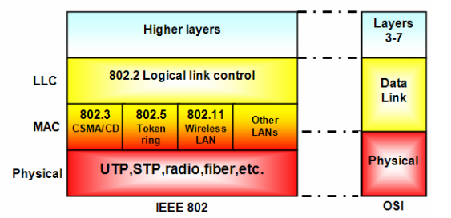

# Configura els diferents modes de funcionament de la targeta de xarxa sense fils  <!-- omit in toc -->

# Índex <!-- omit in toc -->

- [Explica què és l'estàndard IEEE 802.](#explica-què-és-lestàndard-ieee-802)
- [Llista els diferents modes de funcionament del teu adaptador wifi.](#llista-els-diferents-modes-de-funcionament-del-teu-adaptador-wifi)
- [Comprova que la teva interfície és compatible amb el paquet aircrack-ng.](#comprova-que-la-teva-interfície-és-compatible-amb-el-paquet-aircrack-ng)
- [Llista les targetes de xarxa (ip link) - explica què hi veus.](#llista-les-targetes-de-xarxa-ip-link---explica-què-hi-veus)
- [Llista les targetes de xarxa (nmcli) - explica què hi veus.](#llista-les-targetes-de-xarxa-nmcli---explica-què-hi-veus)
- [Llista les targetes de xarxa d'una altre forma diferent però en aquest cas només s'han de veure els noms de les targetes de xarxa com a resultat de la instrucció.](#llista-les-targetes-de-xarxa-duna-altre-forma-diferent-però-en-aquest-cas-només-shan-de-veure-els-noms-de-les-targetes-de-xarxa-com-a-resultat-de-la-instrucció)
- [Desactiva i activa una teva targeta de xarxa](#desactiva-i-activa-una-teva-targeta-de-xarxa)

## Explica què és l'estàndard IEEE 802.

La [IEEE 802](https://www.ieee802.org/) són una sèrie d'estàndards per les xarxes informàtiques, xarxes d'àrea local (LAN) i xarxes d'àrea metropolitana (MAN). 

Aquests estàndards defineixen els serveis i protocols de la capa física i la capa d'enllaç de dades del model OSI.

Entre els seus estàndards podem trobar:
* IEEE 802.3. Ethernet.
* IEEE 802.11. Xarxes sense fils Wi-Fi.
* IEEE 802.15. Wireless PAN (IrDA, Wireless USB, Bluetooth o ZigBee).



## Llista els diferents modes de funcionament del teu adaptador wifi.

```bash
iw list
```

Del resultat podem extraure els diferents modes de funcionament:
```
	Supported interface modes:
		 * IBSS
		 * managed
		 * AP
		 * AP/VLAN
		 * monitor
		 * mesh point
		 * P2P-client
		 * P2P-GO
		 * outside context of a BSS
```

## Comprova que la teva interfície és compatible amb el paquet aircrack-ng.

Per saber si la nostra interfície és compatible necessitem informació de la targeta de xarxa que fem servir. Amb la següent comanda obtenim informació detallada dels dispositius del sistema, en aquesta informació trobem la targeta de xarxa:
```bash
lscpi
```

> 0e:00.0 Network controller: Qualcomm Atheros AR9462 Wireless Network Adapter (rev 01)

Dins la seva [web de compatibilitat](https://www.aircrack-ng.org/doku.php?id=compatibility_drivers_old) podem trobar la meva interfície a la llista. 

A més, hem trobat abans que la interfície suporta el mode *monitor*, mode que necessitarem per l'aircrack-ng.

## Llista les targetes de xarxa (ip link) - explica què hi veus.

## Llista les targetes de xarxa (nmcli) - explica què hi veus.

## Llista les targetes de xarxa d'una altre forma diferent però en aquest cas només s'han de veure els noms de les targetes de xarxa com a resultat de la instrucció.

## Desactiva i activa una teva targeta de xarxa