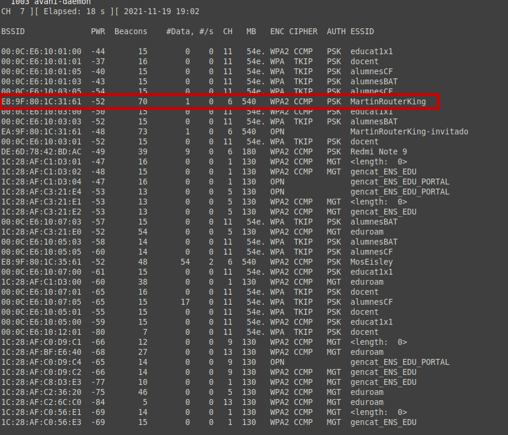

<!--
---
title: "Tècniques d'encriptació de les xarxes sense fils"
author: "Toni Peraira"
date: "2021-11-19"
version: "1.0"
geometry: left=2.54cm,right=2.54cm,top=2.54cm,bottom=2.54cm
header-right: '\headerlogo'
header-includes:
- '`\newcommand{\headerlogo}{\raisebox{0pt}[0pt]{\includegraphics[width=3cm]{../institut_montilivi.png}}}`{=latex}'
---
pandoc README.md -o Toni_Peraira_RA2_2.2.pdf --from markdown --template eisvogel --listings --pdf-engine=xelatex
-->

# Descriu les tècniques d'encriptació de les xarxes sense fils i els seus punts vulnerables <!-- omit in toc -->

# Índex <!-- omit in toc -->

- [Configuració Router](#configuració-router)
- [Executa una instrucció i envia el resultat d'aquesta a una altre instrucció.](#executa-una-instrucció-i-envia-el-resultat-daquesta-a-una-altre-instrucció)
- [Configura el router per tal que faci servir un passsword tipus WEP.](#configura-el-router-per-tal-que-faci-servir-un-passsword-tipus-wep)
- [Configura el router per tal que faci servir un password tipus WPA.](#configura-el-router-per-tal-que-faci-servir-un-password-tipus-wpa)
- [Configura el router per tal que faci servir un password tipus WPA2.](#configura-el-router-per-tal-que-faci-servir-un-password-tipus-wpa2)
- [Configura la targeta wifi per tal que estigui en mode monitor.](#configura-la-targeta-wifi-per-tal-que-estigui-en-mode-monitor)

## Configuració Router


**Aquests són els sistemes de xifrat que permet utilitzar el router**


Segons la pàgina del fabricant sobre aquest model:

WPA2 Personal, WPA2 Enterprise


## Executa una instrucció i envia el resultat d'aquesta a una altre instrucció.

Llistar els fitxers i directoris i els ordenem aleatòriament.

```console
ls -1 | sort -R
```

Per l'anterior pràctica també vam fer alguns exemples com el següent, que llista les interfícies de xarxa i es filtra la sortida amb *awk*:

```
ip -o link show | awk -F': ' '{print $2}'
```


## Configura el router per tal que faci servir un passsword tipus WEP.

El sistema de xifrat WEP (Wired Equivalent Privacy) ja està obsolet perquè és fàcil de desxifrar. Per tant, aquest router no es pot configurar per fer servir aquest tipus d'encriptació. Dels xifrats que es demanen en aquesta pràctica, és el més dèbil.

En resum, no és segur fer-ho servir.

## Configura el router per tal que faci servir un password tipus WPA.

Igual que passa amb el WEP, aquest router tampoc ens permet configurar un password amb WPA, ja que es considera dèbil i ja es pot desxifrar sense gaire dificultat. Tot i que és més segur que el WEP, no és suficient.

## Configura el router per tal que faci servir un password tipus WPA2.

Per defecte ja tenim configurat el password amb WPA2, perquè només ens permet configurar una WPA2 Personal o WPA2 Enterprise.


Segons https://www.tp-link.com/es/support/faq/500/:

**WPA-Personal (WPA-PSK):** Aquest mode és adequat per a les xarxes domèstiques. Els usuaris que es connecten a la xarax ho fan a partir d'una contrasenya o punt d'accés (AP).

**WPA-Enterprise (WPA-802.1x, RADIUS):** Aquest mode està més pensat per a les xarxes sense fil en entorns no domèstics. Ofereix un control individual pels usuaris que es connecten. Quan els usuaris intenten connectar-se a la xarxa, ho han de fer amb unes credencials de sessió.

## Configura la targeta wifi per tal que estigui en mode monitor.

Per l'anterior pràctica ja vaig configurar la targeta per treballar en mode monitor.


Fem una prova amb aircrak-ng per monitorar:

```
sudo airmon-ng start wlp14s0
```


```
sudo airmon-ng check kill
sudo airodump-ng wlp14s0mon
```

