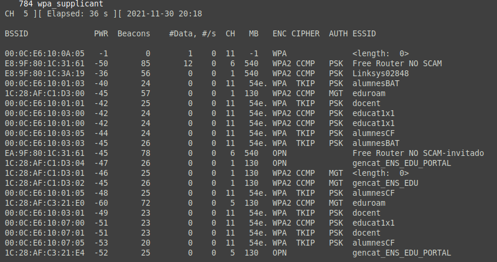
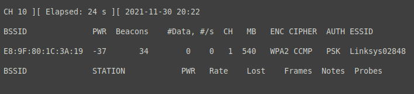
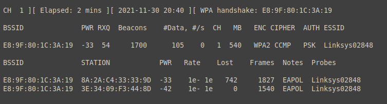
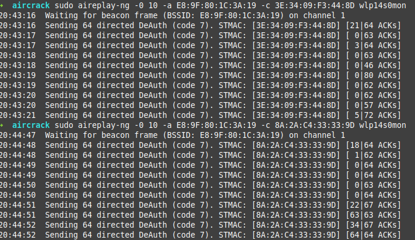
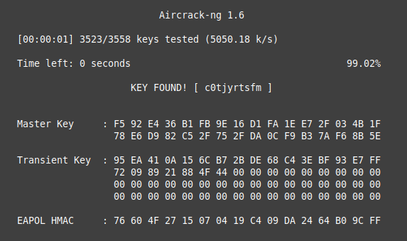

<!---
title: "RA2 - 2.4"
author: "Toni Peraira"
date: "2022-01-13"
version: "1.0"
geometry: left=2.54cm,right=2.54cm,top=2.54cm,bottom=2.54cm
header-right: '\headerlogo'
header-includes:
- '`\newcommand{\headerlogo}{\raisebox{0pt}[0pt]{\includegraphics[width=3cm]{../institut_montilivi.png}}}`{=latex}'
---

<!--
pandoc README.md -o Toni_Peraira_RA2_2.4.pdf --from markdown --template eisvogel --listings --pdf-engine=xelatex --toc -s -V toc-title:"Índex"
-->

Accedeix a xarxes sense fils vulnerables.

- [Investiga el paquet aircrack-ng](#investiga-el-paquet-aircrack-ng)
- [Què volen dir les sigles PSK dels algoritmes WPA/WPA2-PSK?](#què-volen-dir-les-sigles-psk-dels-algoritmes-wpawpa2-psk)
- [Què és la clau pre-compartida?](#què-és-la-clau-pre-compartida)
- [Fent ús dels paquets capturats (amb el handshake) intenta aconseguir la clau compartida, explica com ho faries en cas que no te'n surtis.](#fent-ús-dels-paquets-capturats-amb-el-handshake-intenta-aconseguir-la-clau-compartida-explica-com-ho-faries-en-cas-que-no-ten-surtis)
- [Un cop aconsegueixis la clau compartida, com la faries servir?](#un-cop-aconsegueixis-la-clau-compartida-com-la-faries-servir)

## Investiga el paquet aircrack-ng

Aircrack-ng és la suite per excel·lència de seguretat de xarxes WiFi, permetent **monitorar, atacar, crackejar i testejar** aquestes. 
Concretament aircrack-ng tal com es defineix a la seva web, és un programa crackejador de claus 802.11 WEP i WPA/WPA2-PSK.

Amb aquesta suite podem capturar paquets per fer-los servir per exemple per fer atacs de repetició, desautenticació com ja hem fet a classe, punts d'accés falsos, entre altres. 

Un cop tenim suficients paquets capturats encriptats amb airodump-ng, aircrack-ng ja és capaç de recuperar la clau WEP, combinant atacs amb força bruta.
Per altra banda, per desxifrar les WPA/WPA2-PSK que són més segures ens hem d'ajudar d'un diccionari.

La suite funciona amb línia de comandes permetent una màxima "scriptació". Tot i estar pensada per treballar amb Linux, podem fer-la en altres sistemes operatius.

A la suite podem trobar les següents eines:

- airbase-ng – Configurar punts d'accés falsos.
- aircrack-ng – El crackejador de contrasenyes i l'eina que dóna nom a la suite.
- airdecap-ng – Desencriptar arxius de paquets WEP i WPA/WPA2-PSK.
- airdecloak-ng – Esborrar el *wep cloaking* de arxius pcap, arxius amb les dades dels paquets.
- airdriver-ng – Proporciona informació dels drivers de xarxa del sistema.
- aireplay-ng – Generador de trànsit per l'ús amb altres eines.
- airmon-ng – Habilitar el mode monitor de les interfícies de xarxa, cosa que ens permet esnifar les xarxes.
- airodump-ng – Capturar paquets sense format de les xarxes WiFi.
- airodump-ng-oui-update – Actualitzar la llista IEE OUI.
- airolib-ng – Emmagatzemar i administrar la llista de contrasenyes i ESSID (identificació de cada xarxa).
- airserv-ng – Un servidor de targetes sense fil.
- airtun-ng – Creador d'interfícies de túnel virtuals.
- besside-ng – Craqueja automàticament xarxes WEP i WPA.
- besside-ng-crawler – Filtra fotogrames EAPOL d'un directori d'arxius capturats.
- buddy-ng – Una eina per treballar amb easside-ng.
- easside-ng – Una eina de màgia automàtica que permet la comunicació mitjançant un punt d'accés xifrat amb WEP.
- ivstools – Aquesta eina gestiona fitxers .ivs per combinar-los o convertir-los.
- kstats – Mostra estadístiques de l'algoritme FMS per bolcatges ivs i una clau WEP especificada. 
- makeivs-ng – Genera vectors d'inicialització.
- packetforge-ng – Crear paquets xifrats que es poden utilitzar posteriorment en injeccions.
- tkiptun-ng – Aquesta eina és capaç d'injectar uns quants fotogrames a una xarxa WPA TKIP amb QoS.
- wesside-ng – Eina automàtica que incorpora una sèrie de tècniques per obtenir una clau WEP sense problemes.
- wpaclean – Eliminar l'excés de dades d'un arxius pcap.

## Què volen dir les sigles PSK dels algoritmes WPA/WPA2-PSK?

PSK (Pre Shared Key), en català clau precompartida.

## Què és la clau pre-compartida?

Es tracta d'una clau secreta que comparteixen el client i el AP abans de fer-se la connexió i que s'envia xifrada per un canal segur.

Amb aquesta clau precompartida es desxifra la comunicació entre els dos punts.

És com quan dues persones creen una clau secreta que serveix per desxifrar el contingut d'un text. Un cop tenen la clau precompartida es poden enviar textos que únicament poden ser llegibles si tens la clau per desxifrar-ho.

En una autenticació Wi-Fi, la clau precompartida serveix perquè els clients es puguin autenticar a la xarxa sense fils.

## Fent ús dels paquets capturats (amb el handshake) intenta aconseguir la clau compartida, explica com ho faries en cas que no te'n surtis.

Aprofitant que ja vaig aconseguir la clau compartida en la pràctica anterior, faré un copiar i enganxar de l'explicació passada.

Farem servir aircrack-ng per obtenir la clau pre-compartida.

Amb la interfície de xarxa en mode monitor busquem quin serà l'objectiu, serà la xarxa **Linksys02848**, que pertany al router de proves.



---

Iniciem l'airodump-ng per capturar el handshake en el moment que un dispositiu s'autentiqui.

```console
sudo airodump-ng -c 1 --bssid E8:9F:80:1C:3A:19 --write ~/aircrack/poc --output-format pcap wlp14s0mon
```
* -c 1: Canal de la xarxa Wi-Fi.
* --bssid E8:9F:80:1C:3A:19: Adreça MAC de l'AP (Punt d'accés). Per fer servir únicament el trànsit d'aquesta xarxa.
* --write ~/aircrack/poc: Escriurem sobre aquest fitxer on es guardaran els IV (Initialization Vector), bloc de bits. La informació dels paquets capturats.
* --output-format pcap
* wlp14s0mon: El nom de la interfície de xarxa.



En Joel i jo ens hem connectat amb els mòbils a la xarxa Wi-fi, això ha provocat que apareguin dos elements a la llista.



Les MAC dels nostres mòbils:

* 3E:34:09:F3:44:8D 
* 8A:2A:C4:33:33:9D

---

Llancem un atac de desautenticació, això envia un missatge al client per desassociar-lo de l'AP. 

Ho fem per accelerar el procés de capturar el handshake. Aquesta acció obligarà al client a reautenticar-se, la qual cosa genera els 4 paquets d'autenticació (handshake) que volem capturar.

```console
sudo aireplay-ng -0 10 -a E8:9F:80:1C:3A:19 -c 3E:34:09:F3:44:8D wlp14s0mon

sudo aireplay-ng -0 10 -a E8:9F:80:1C:3A:19 -c 8A:2A:C4:33:33:9D wlp14s0mon
```

* 0: Deautenticació.
* 1: Número de deautenticacions a enviar.
* -a E8:9F:80:1C:3A:19: adreça MAC de l'AP.
* -c 3E:34:09:F3:44:8D & 8A:2A:C4:33:33:9D: Adreça MAC del client a deautenticar.
* wlp14s0mon: El nom de la interfície de xarxa.



Aquest atac ha provocat que els nostres dispositius es desconnectin, ens hem tornat a connectar.

---

Intentem trobar la clau WPA/WPA2 precompartida. Farem un diccionari amb possibles claus, on hem afegit manualment la clau de la xarxa.

```console
aircrack-ng -w password.lst -b E8:9F:80:1C:3A:19 *.cap
```

* -w password.lst: Diccionari amb les possibles claus.
* *.cap: Grupo d'arxius que contenen els paquets capturats, tots aquells que acabin per .cap.



ET VOILÀ! Hem aconseguit la clau precompartida: *c0tjyrtsfm*.

## Un cop aconsegueixis la clau compartida, com la faries servir?

Un cop aconseguida la faria servir per connectar-me a la xarxa de forma il·legal, sense el consentiment del propietari, per descarregar amb l'eMule fins que em pillin o canviïn les credencials.
També entraria a Animeflv per veure Inazume Eleven.
Bàsicament aprofitar-me de l'internet gratuït.

Dit d'una altra manera, per auditar la xarxa i mantenir-la segura de possibles atacs, analitzant els seus punts més febles per assegurar el seu bon funcionament.