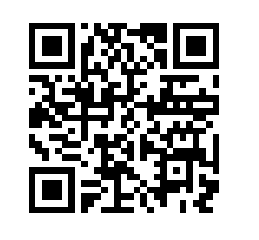

<!-----
title: "RA2 - 2.5 Bluetooth, NFC i QR"
author: "Toni Peraira"
date: "2022-01-13"
version: "1.0"
geometry: left=2.54cm,right=2.54cm,top=2.54cm,bottom=2.54cm
header-right: '\headerlogo'
header-includes:
- '`\newcommand{\headerlogo}{\raisebox{0pt}[0pt]{\includegraphics[width=3cm]{../institut_montilivi.png}}}`{=latex}'
---

<!--
pandoc README.md -o Toni_Peraira_RA2_2.5.pdf --from markdown --template eisvogel --listings --pdf-engine=xelatex --toc -s -V toc-title:"Índex"
-->

Caracteritza altres sistemes de comunicació sense fils i les seves vulnerabilitats.

- [Quin és el model de comunicació de bluetooth 1.0 i 2.0, quin model d'autenticació utilitza?](#quin-és-el-model-de-comunicació-de-bluetooth-10-i-20-quin-model-dautenticació-utilitza)
- [Quin és el model de comunicació de bluetooth 3.0, quin model d'autenticació utiltiza?](#quin-és-el-model-de-comunicació-de-bluetooth-30-quin-model-dautenticació-utiltiza)
- [Llista eines que es poden fer servir per hackejar sistemes bluetooth](#llista-eines-que-es-poden-fer-servir-per-hackejar-sistemes-bluetooth)
- [Què és NFC? Quin és el seu ús més freqüent?](#què-és-nfc-quin-és-el-seu-ús-més-freqüent)
- [Què és QR? Quin és el seu ús més freqüent?](#què-és-qr-quin-és-el-seu-ús-més-freqüent)
- [Genera un codi QR i afegeix-lo a l'informe.](#genera-un-codi-qr-i-afegeix-lo-a-linforme)

## Quin és el model de comunicació de bluetooth 1.0 i 2.0, quin model d'autenticació utilitza?

El model de comunicació de Bluetooth 1.0 i 2.0 és el Peer-to-Peer, xarxa entre iguals. En una comunicació P2P els dispositius es connecten i comuniquen entre si sense fer servir un servidor central on connectar-se.

Utilitza el BR/EDR legacy com a model d'autenticació basat en l'aparellament a partir d'un codi PIN numèric.

## Quin és el model de comunicació de bluetooth 3.0, quin model d'autenticació utiltiza?

A diferència dels anteriors, el Bluetooth 3.0 fa servir comunicació client-servidor amb BR/EDR security.

A partir del Bluetooth 2.1 s'utilitza el Secure Simple Pairing (SSP) amb Legacy Authentication com a model d'autenticació. Es tracta d'un mecanisme on un dels dispositius és qui sol·licita la comunicació i l'altre és qui rep la sol·licitud i qui la verifica. Els dispositius comparteixen una clau secreta. Qui verifica la comunicació s'encarrega de comprovar que la clau que utilitza el sol·licitant és la mateixa que té ell.

Secure Simple Pairing utilitza algoritmes segurs per fer el pairing i assegurar la integritat de la comunicació, amb això es va millorar la seguretat del BR/EDR legacy. La diferència amb BR/EDR security, és que aquests de les versions anteriors no feien servir algoritmes segurs i aprovats per l'entitat FIPS.

## Llista eines que es poden fer servir per hackejar sistemes bluetooth

A la pàgina d'eines de Kali podem trobar un llistat de les que incorpora el sistema operatiu, un total de 29:

https://en.kali.tools/all/?category=bluetooth

- bleah:	A BLE scanner for "smart" devices hacking.
- blue-hydra:	A Bluetooth device discovery service built on top of the bluez library.
- bluebugger:	An implementation of the bluebug technique which was discovered by Martin Herfurt.
- bluediving:	A Bluetooth penetration testing suite.
- bluefog:	A tool that can generate an essentially unlimited number of phantom Bluetooth devices.
- bluelog:	A Bluetooth scanner and sniffer written to do a single task, log devices that are in discoverable mode.
- bluepot:	A Bluetooth Honeypot written in Java, it runs on Linux
- blueprint:	A perl tool to identify Bluetooth devices.
- blueranger:	A simple Bash script which uses Link Quality to locate Bluetooth device radios.
- bluescan:	A Bluetooth Device Scanner.
- bluesnarfer:	A bluetooth attacking tool
- bluphish:	Bluetooth device and service discovery tool that can be used for security assessment and penetration testing.
- braces:	A Bluetooth Tracking Utility.
- bss:	Bluetooth stack smasher / fuzzer
- bt_audit:	Bluetooth audit
- btcrack:	The world's first Bluetooth Pass phrase (PIN) bruteforce tool. Bruteforces the Passkey and the Link key from captured Pairing exchanges.
- btlejack:	Bluetooth Low Energy Swiss-army knife.
- btproxy-mitm:	Man in the Middle analysis tool for Bluetooth.
- btscanner:	Bluetooth device scanner.
- carwhisperer:	Intends to sensibilise manufacturers of carkits and other Bluetooth appliances without display and keyboard for the possible security threat evolving from the use of standard passkeys.
- crackle:	Crack and decrypt BLE encryption
- fl0p:	A passive L7 flow fingerprinter that examines TCP/UDP/ICMP packet sequences, can peek into cryptographic tunnels, can tell human beings and robots apart, and performs a couple of other infosec-related tricks.
- ghettotooth:	Ghettodriving for bluetooth
- hidattack:	HID Attack (attacking HID host implementations)
- obexstress:	Script for testing remote OBEX service for some potential vulnerabilities.
- redfang:	Finds non-discoverable Bluetooth devices by brute-forcing the last six bytes of the devices' Bluetooth addresses and calling read_remote_name().
- spooftooph:	Designed to automate spoofing or cloning Bluetooth device Name, Class, and Address. Cloning this information effectively allows Bluetooth device to hide in plain sight
- tbear	Transient Bluetooth Environment Auditor includes an ncurses-based Bluetooth scanner (a bit similar to kismet), a Bluetooth DoS tool, and a Bluetooth hidden device locator.
- ubertooth:	A 2.4 GHz wireless development board suitable for Bluetooth experimentation. Open source hardware and software. Tools only.

Altres exemples que podem fer servir amb Kali però que no apareixen en el llistat:

- hciconfig i hcitool: S'utilitza per configurar dispositius Bluetooth.
- sdptool: Proporciona la interfície per realitzar consultes SDP en dispositius Bluetooth.
- l2ping: Enviar una petició echo L2CAP a l'adreça MAC Bluetooth.

## Què és NFC? Quin és el seu ús més freqüent?

NFC (Near Field Communication) és una tecnologia sense fils d'alta freqüència que permet la comunicació de curt rang entre dispositius. Quan dos dispositius amb tecnologia NFC s'apropen, permeten la comunicació entre ells. Es basa en la creació d'un camp electromagnètic per l'intercanvi de dades.

En el meu cas personal, únicament he fet servir NFC per fer ús del meu DNI electrònic. Es pot fer servir un mòbil amb funcionalitat NFC per aproximar-lo al DNI i poder signar un certificat digital amb la nostra clau única, si tenim el mòbil connectat amb USB a un PC.

Amb el certificat signat podem fer les gestions burocràtiques pertinents. De no existir això i amb els sistemes públics totalment col·lapsats, mai hauria pogut fer totes les gestions que em demanaven al néixer la meva filla.

Per tant, un dels seus usos més freqüents és la identificació. Habitualment és utilitzat per fer pagaments amb el mòbil, substituint les targetes de crèdit/dèbit.

## Què és QR? Quin és el seu ús més freqüent?

QR és un sistema que permet emmagatzemar informació en una matriu quadrada de punts. És a dir, dins una imatge que és un quadre de punts únic, trobem la informació contenida. Aquesta imatge pot ser llegida mitjançant una càmera i un lector. En resum, és un codi de barres de dues dimensions.

El cas comentat amb el DNI electrònic també es pot fer amb QR, substituint la connexió USB entre mòbil i PC per un codi QR que es genera al PC des d'una aplicació i que podem llegir amb el mòbil, que està connectat per NFC al DNI.

El seu ús més freqüent és el d'assignar una adreça URL al codi QR per tal de fer una redirecció. Des de la gran pandèmia del Coronavirus, habitualment trobem codis QR en restaurants, els quals contenen una adreça des d'on consultar la seva carta.

## Genera un codi QR i afegeix-lo a l'informe.

Per generar un codi QR he fet el següent codi en JavaScript:

```js
import QRCode from "qrcode-svg";

/**
 * Generate a QR code with a specific content. The QR code is saved in a SVG file, for the best image quality.
 * @param {String} filename Name of the file with the QR code.
 * @param {String} content QR content.
 */
const generateQR = async (filename = "qr", content = " ") => {
    try {
        // QR code options.
        let qrcode = new QRCode({
            content,
            padding: 5,
            width: 256,
            height: 256,
            color: "#000",
            background: "#fff",
            ecl: "M" // error correction level
        });

        // Save file.
        qrcode.save(filename + ".svg", (err) => {
            if (err) throw err;
            console.log("QR Generated!");
        });
    } catch (err) {
        console.error("Error generating QR code", err)
    }
}

generateQR("qr", "https://toni-pm.herokuapp.com");
```

